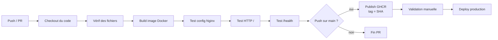

# Nginx CI/CD Demo

Projet de démonstration d'une pipeline **CI/CD** avec **GitHub Actions** et **Docker / Nginx**.
Réalisé dans le cadre du TP CI/CD (BESOMBE Tristan).

## Objectif

Servir une page web via Nginx dans un conteneur Docker, et automatiser le
build, les tests, la publication et le déploiement grâce à un pipeline qui se
déclenche à chaque modification du code.

## Structure du projet

```
nginx-ci-demo/
├── default.conf                 # Configuration Nginx (+ endpoint /health)
├── index.html                   # Page servie par Nginx
├── Dockerfile                   # Construction de l'image
├── .gitignore                   # Empêche de versionner des secrets
└── .github/
    └── workflows/
        └── ci.yml               # La pipeline CI/CD
```

## Schéma de la pipeline



## Explication des étapes

| Étape | Rôle |
|-------|------|
| **Trigger** | Le pipeline démarre sur `push` et `pull_request` vers `main`. |
| **Vérif fichiers** | Échoue si `Dockerfile`, `default.conf` ou `index.html` manquent. |
| **Build** | Construit l'image Docker à partir du Dockerfile. |
| **Test Nginx** | `nginx -t` valide la syntaxe de la config. |
| **Test HTTP** | Lance le conteneur et vérifie que `/` répond `200`. |
| **Test /health** | Vérifie le endpoint de santé (`200`). |
| **Publish** | Pousse l'image dans GHCR, taguée avec le SHA du commit. |
| **Deploy** | Déploiement simulé, déclenché après validation manuelle. |

## Sécurité

- Aucun secret n'est écrit dans le code ni dans les logs.
- L'authentification au registry utilise le `GITHUB_TOKEN` automatique.
- Le `.gitignore` bloque les fichiers sensibles (`.env`, clés, etc.).

## Lancer en local

```bash
docker build -t nginx-ci-demo .
docker run -d -p 8080:80 nginx-ci-demo
curl http://localhost:8080/
curl http://localhost:8080/health
```
